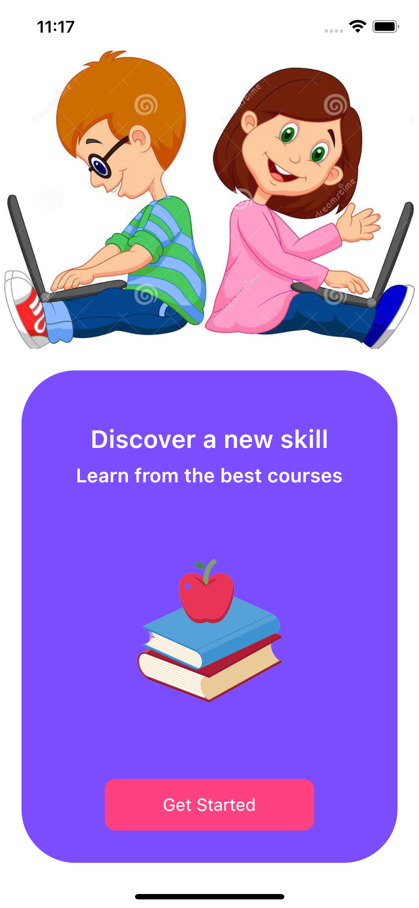

# Education

⚡️ This project uses the flutter UI tool kit to build an education/skill app for offering online tutorials.

UI design inspiration: https://www.instagram.com/p/Cb8eZlcg7Ub/?igshid=YmMyMTA2M2Y=

## Screenshots

| Splash Screen | Home Screen | 
|    :---:     |     :---:      |  
|    |    |

## Contributions

🎉 Feel free to contribute to this project.

If you find a bug or want a feature and don't know how to fix, implement or go about it, please fill an issue.

If you fixed a bug or implemented a feature, please send a pull request.
